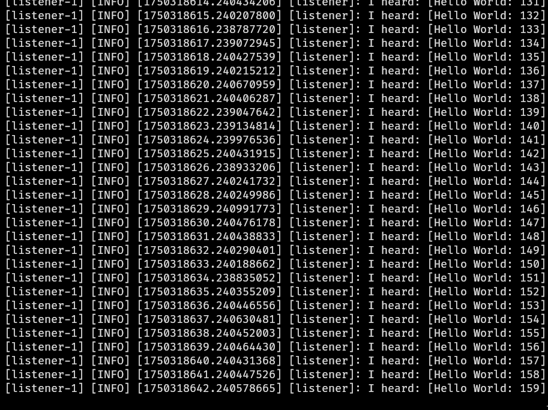
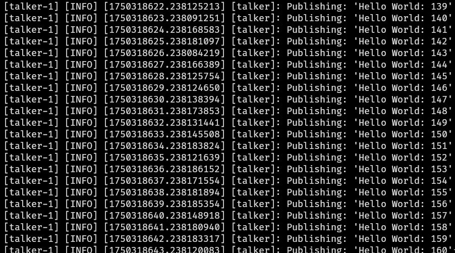

# dev_ws

A basic ROS 2 package demonstrating a talker and listener node.

### Talker Node Output
This shows the talker node publishing messages to the `/chatter` topic.

### Listener Node Output
This shows the listener node subscribing to the `/chatter` topic and printing the received messages.

